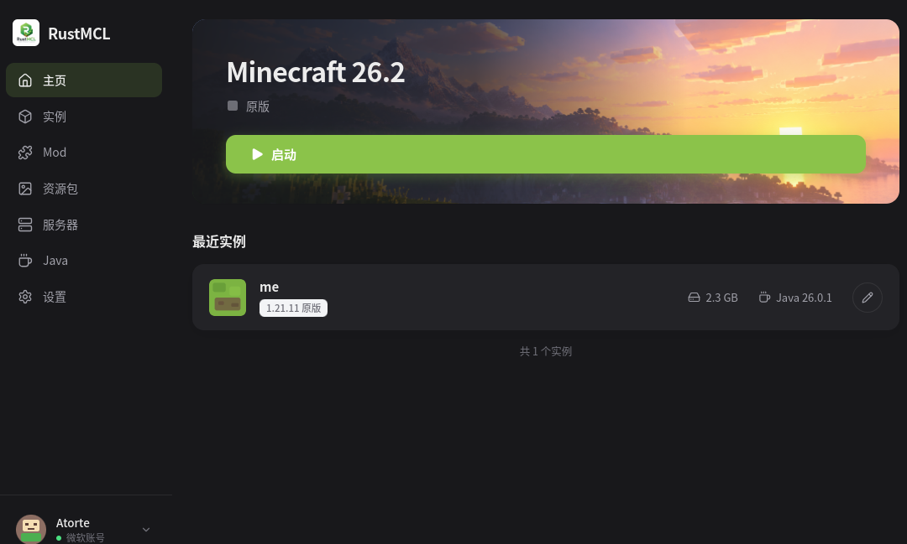
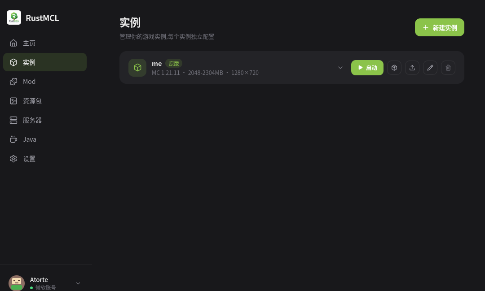
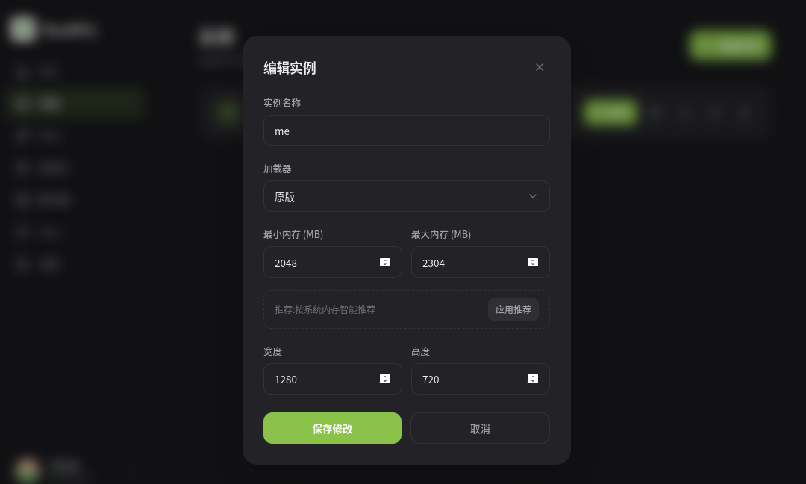
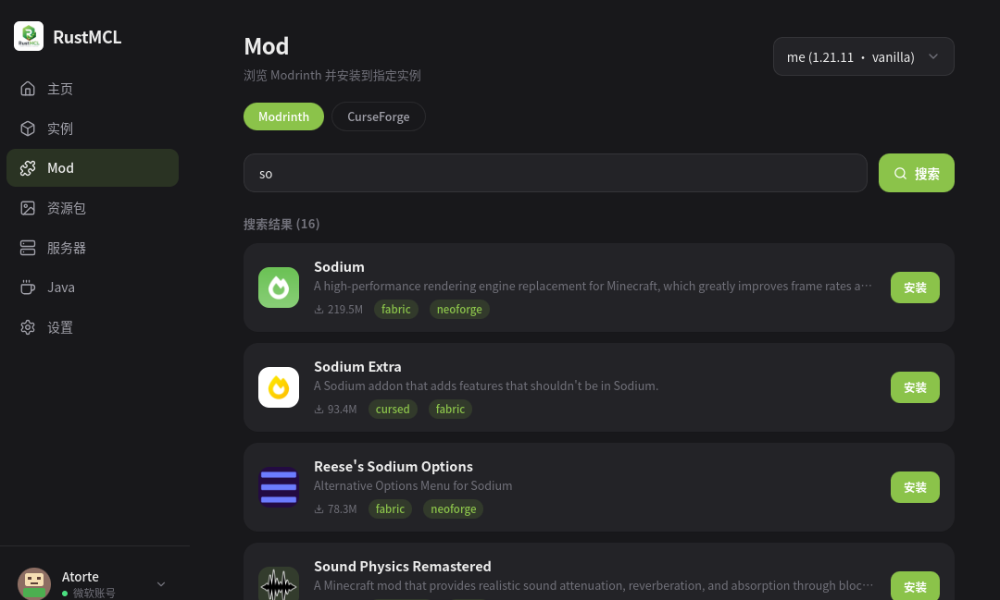
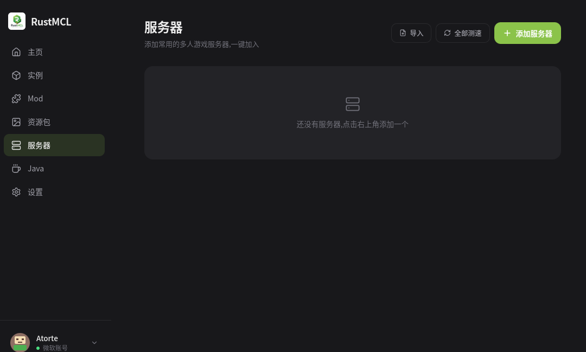
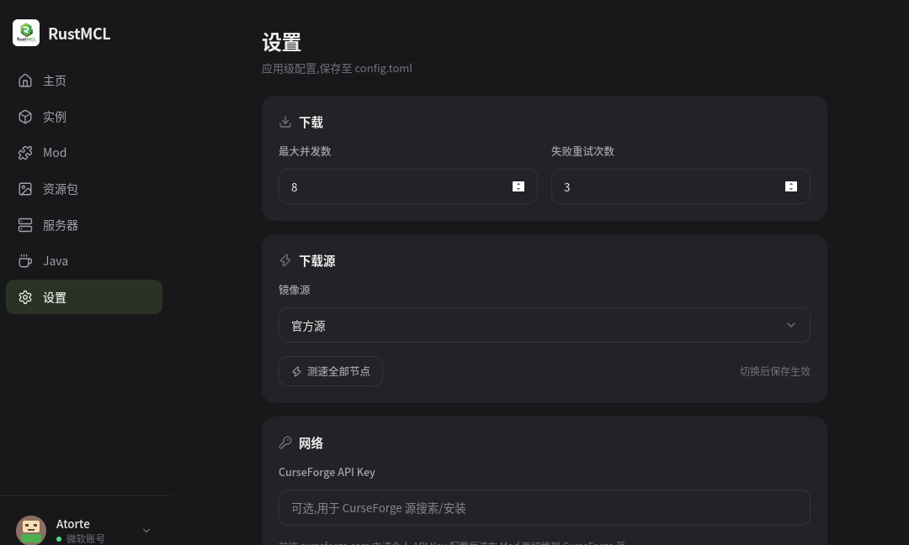
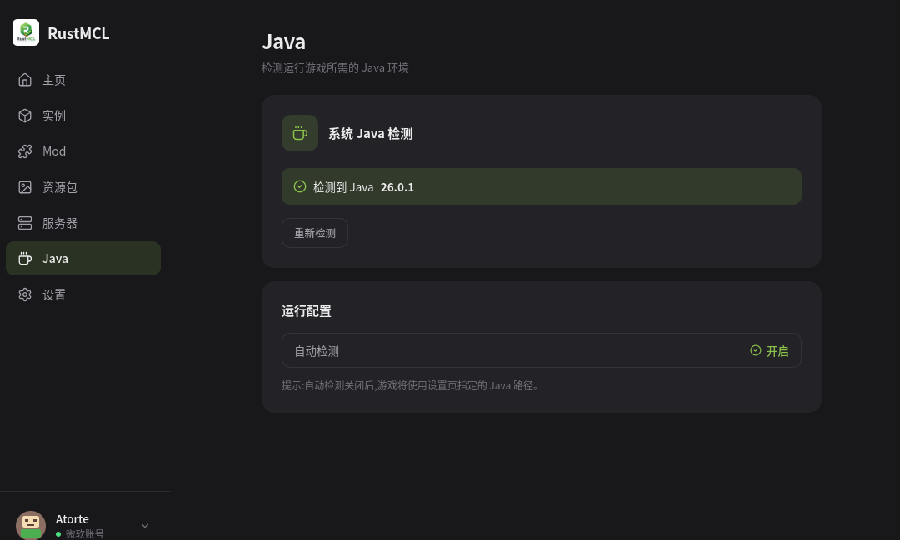
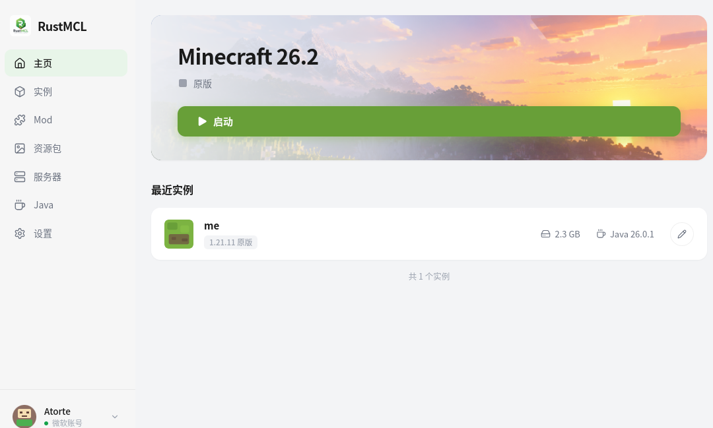
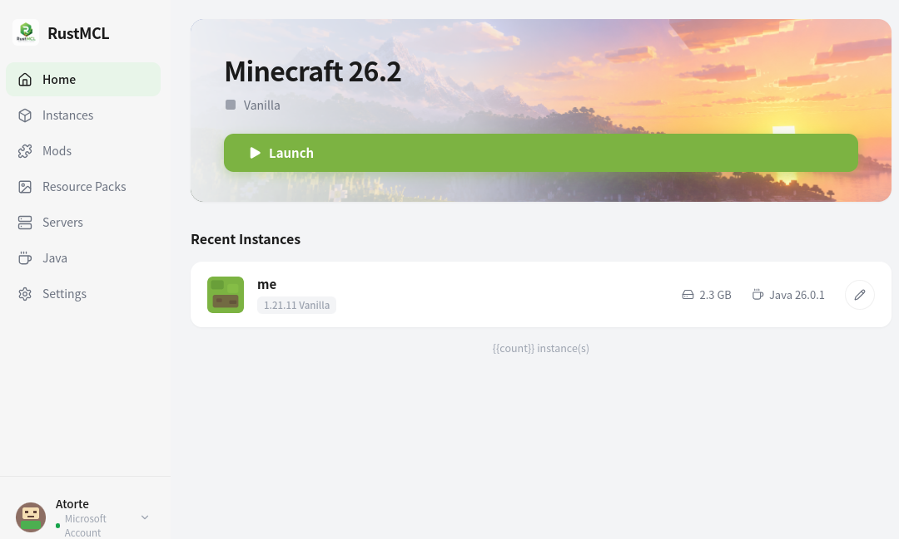

# RustMCL

> A modern, lightweight, cross-platform Minecraft: Java Edition launcher.

[](LICENSE)


> **中文:** 需要中文版?请查看 [中文 README](README.md)。

---

**RustMCL** (aka **rmcl**, formerly **Runa**) is a Minecraft: Java Edition launcher built with **Rust + Tauri**. It provides instance management for vanilla and community loaders (Forge / Fabric / Quilt), both Microsoft and offline account login, and unified management of mods, modpacks, servers, and other resources — while leveraging Tauri to keep resource usage much lower than comparable Electron-based launchers.

Completely open source under [GPL-3.0](LICENSE). Repository: <https://github.com/tortb/RustMCL.git>.

---

## Screenshots / Preview

A tour of the Home, Instance management, Mod search, Servers, Settings, and Java detection screens (supports light / dark themes and Chinese / English UI):

<table>
  <tr>
    <td></td>
    <td></td>
  </tr>
  <tr>
    <td></td>
    <td></td>
  </tr>
  <tr>
    <td></td>
    <td></td>
  </tr>
  <tr>
    <td></td>
    <td></td>
  </tr>
  <tr>
    <td></td>
    <td></td>
  </tr>
</table>

---

## Key Features

### Game & Loaders

- **Cross-version**: pulls official release / snapshot version lists from the Mojang metadata.
- **Multi-loader support**: vanilla, **Fabric / Quilt** (via meta API to merge profiles into `version.json`), **Forge** (version manifest / installer extraction / processors execution engine / client processor filtering).
- **Instance management**: create, edit, delete and list instances; launching auto-fills missing resources idempotently.
- **Downloader**: concurrent multi-threaded downloads, per-file SHA1 verification, retry on failure, atomic `.part` → final rename; existing files that pass verification are skipped from cache.

### Accounts

- **Microsoft login**: OAuth 2.0 **Device Code Flow**, then the standard Xbox Live → XSTS → Minecraft Services token exchange. The refresh token is kept only in the OS credential manager (keyring).
- **Offline login**: validates a local username, generates a stable UUID, and can enter the game offline.

### Mods / Modpacks / Resources

- **Mod management**: **Modrinth** integration (search, version resolution, install to an instance, dependency checks) with enable / disable / delete; plus **CurseForge** search & install (API key required in settings).
- **Modpacks**: **mrpack** import & export, with CurseForge modpack parsing (API key required); validates MC / loader compatibility and guards against Zip-slip path traversal on import.
- **Resource packs / shaders**: local scan, enable / disable (rename to `.disabled`), delete, and shader dependency detection (Iris / OptiFine).

### Servers

- **Server list**: add, delete, favorite, drag-to-sort, and one-click join a running instance; imports from the classic `servers.dat`.
- **Latency ping**: built-in Minecraft server list protocol (Handshake → Status) parser, periodic ping showing latency and MOTD.

### System Integration

- **Java environment**: auto-detects local Java and **recommends JVM arguments** based on system memory tier / mod count.
- **Skin management**: local skin library import & validation, upload to a Microsoft account, offline-account skin association, plus a 3D preview.
- **Crash log analysis**: rule-based matching (out-of-memory / Java version mismatch / mod conflict / GPU driver, etc.), locates related mods and suggests fixes.
- **Saves & screenshots**: list, backup zip, restore, delete saves; list, delete, preview screenshots (with path protection).
- **Mirrors**: official / BMCLAPI / MCBBS / custom download sources, with automatic latency probing.
- **Settings**: download source probing, Java path, CurseForge key, theme & language persisted to `config.toml`.

### UI & Performance

- **Apple-style UI**: frosted glass, smooth animations, unified design tokens and components.
- **Lightweight**: based on Tauri, lower resource usage than Electron-based launchers.

---

## Install / Download

**v0.1.1 is now available.** Grab the installer for your platform from [GitHub Releases](https://github.com/tortb/RustMCL/releases); you can also build from source below.

---

## Building from Source

### Prerequisites

| Dependency | Version | Notes |
|---|---|---|
| [Rust](https://www.rust-lang.org/) | stable (1.75+ recommended) | Backend & Tauri shell |
| [Node.js](https://nodejs.org/) | 18+ | Frontend (Vite + React) |
| [Tauri CLI](https://tauri.app/) | via `npm` | Provided by `@tauri-apps/cli` |
| System deps | — | Linux needs `webkit2gtk`, `gtk`, etc.; see [Tauri Prerequisites](https://tauri.app/start/prerequisites/) |

### Steps

```bash
# 1. Clone the repository
git clone https://github.com/tortb/RustMCL.git
cd RustMCL

# 2. Install frontend dependencies
npm install

# 3. Dev mode (starts Vite dev server + compiles and runs the Tauri app)
npm run tauri dev

# 4. Build the production bundle
npm run tauri build
```

> The frontend `npm run build` first runs `tsc && vite build` to produce `dist/`, which Tauri then packages.

---

## Privacy & Security

This project uses **OAuth 2.0 Device Code Flow** for Microsoft login, then the standard **Xbox Live → XSTS → Minecraft Services** token exchange, solely to obtain a valid session needed to launch the game locally.

It **does not store** your Microsoft account password; only the refresh token is saved on your machine (via the OS credential manager) to keep you logged in, and it is never transmitted to any third party. The launcher does not collect, log, or transmit authentication data to developers or any external party.

All authentication code is public in this repository and open for review.

---

## Contributing

Thanks for your interest in RustMCL!

- **Bug reports / feature requests**: first search [Issues](https://github.com/tortb/RustMCL/issues) for existing discussion; if none, open a new issue with reproduction steps, environment details (OS, Rust/Node versions), and relevant logs.
- **Pull requests**: work from a branch off `main`, keep commit messages clear (follow the `type(scope): subject` convention, e.g. `feat(mods): ...`, `fix(account): ...`); describe the motivation and how you verified the change.
- **Coding**: match the existing style; for UI changes, keep the Apple-style design tokens and motion conventions.

---

## License

Released under the [GNU General Public License v3.0](LICENSE).

---

## Acknowledgements

RustMCL's Microsoft authentication and resource flows draw on the existing implementations of many open-source launchers (HMCL, PrismLauncher, etc.) and the authentication protocol descriptions from the [Minecraft Wiki / wiki.vg](https://wiki.vg/index.php?title=Microsoft_Authentication_Scheme). Thanks to all of them.

---

## Roadmap

Planned / in-progress features, not yet implemented:

- **Online search & install of resource packs / shaders** (currently local scan & management only).
- **Self-update actually working** (the update endpoint is an `example.com` placeholder; needs a real release source).
- **Multiple instances running in parallel** (currently the frontend allows only one running instance at a time).
- **Theme / language switching fully in effect** (persisted now; runtime application to be confirmed).
- **Offline-account skin rendered in-game** (currently local association + preview).
- More import/export forms beyond `servers.dat`.
